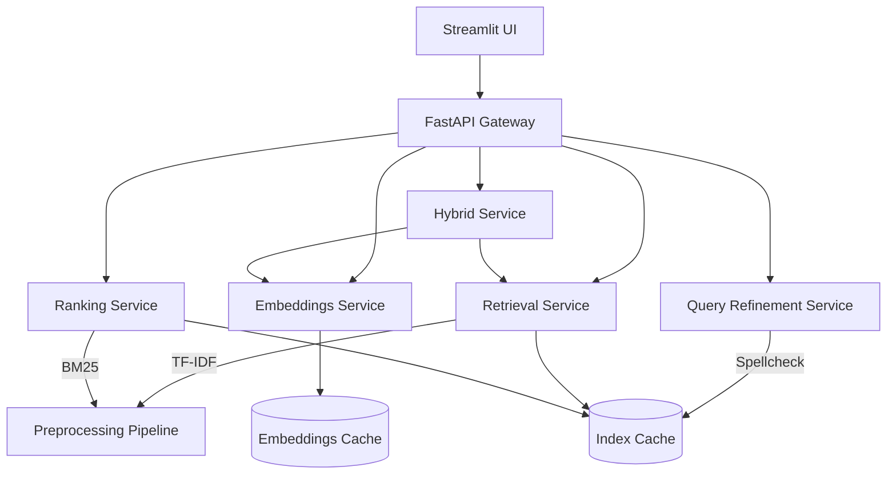
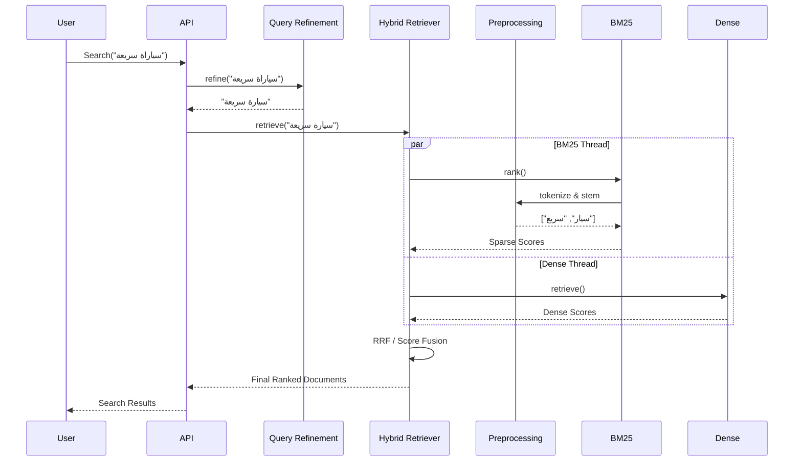
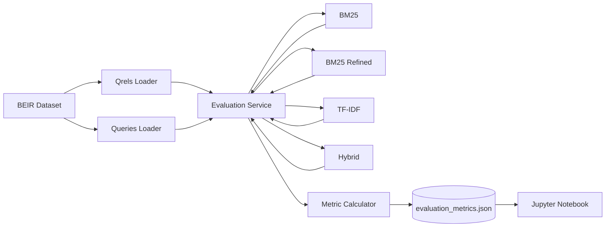

# IR Search Engine Architecture

This document visualizes the Service-Oriented Architecture (SOA) of the IR Search Engine.

## Core System Architecture

## Retrieval Pipeline

## Evaluation Pipeline

